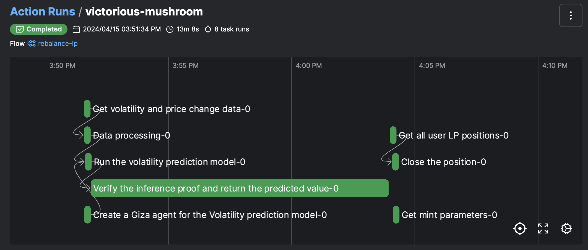

# Introduction

Welcome to this step-by-step tutorial on leveraging Zero-Knowledge Machine Learning (ZKML) for volatility prediction to manage a liquidity position on Uniswap V3. In this guide, we will walk through the entire process required to set up, deploy, and maintain an intelligent liquidity management solution using Giza stack. By the end of this tutorial, you will have a functional system capable of optimizing your liquidity contributions based on predictive market analysis.

The primary goal here is to use machine learning predictions to adjust your liquidity position dynamically in response to anticipated market volatility, thereby maximizing your potential returns and minimizing risks. This project combines concepts from decentralized finance (DeFi), machine learning, and blockchain privacy enhancements (specifically Zero-Knowledge Proofs) to create a liquidity providing strategy for Uniswap V3, one of the most popular decentralized exchanges.

Note: This project constitutes a Proof of Concept and should not be deployed on a mainnet, since it's likely to underperform. When developing a production-grade liquidity management system, you should consider multiple factors, such as gas fees or impermanent loss. For an intorduction into the art of liquidity management on Uniswap V3, you can refer to the following articles:

- [A Primer on Uniswap v3 Math: As Easy As 1, 2, v3](https://blog.uniswap.org/uniswap-v3-math-primer)
- [[DeFi Math] Uniswap V3 Concentrated Liquidity](https://medium.com/@chaisomsri96/defi-math-uniswap-v3-concentrated-liquidity-bd87686b3ecf)
- [Impermanent Loss in Uniswap V3](https://medium.com/auditless/impermanent-loss-in-uniswap-v3-6c7161d3b445)

# 1. Uniswap V3 Overview

Uniswap V3 is a third version of the Uniswap decentralized exchange. It allows users to swap between any pair of ERC-20 tokens in a permissionless way. Additionally, it allows the liquidity providers (LPs) to choose the custom price ranges in order to maximize the capital efficiency.

In a nutshell, LPs earn a fee on each swap performed within a given pool. When LPs want to provide the liquidity, they choose a price range (formally, represented in the form of ticks), within which their deployed capital can be used by other users to perform their swaps. The tighter these bounds are chosen, the greater the return to the LP can be. However, if the price deviates outside of those bounds, the LP no longer earns any fees. Because of that, choosing the price range is of utmost importance for a liquidity provider.

One of the metrics that an LP can use to decide on the most optimal liquidity bounds is the price volatility of a given pair. If the LP expects a high volatility to occur, they would deploy their liquidity in a wider range to prevent from the price deviating outside of their bounds, thus losing them money. Conversely, if the LP expects a low volatility, they would deploy a tighter-bound position in orderd to increase the capital efficiency and as a result generate more yield.

In this project we will use the volatility prediction to adjust the width of the LP liquidity bounds.

# 2. Setting up Your Development Environment

- Python 3.11 or later must be installed on your machine
- Giza CLI must be installed on your machine. You can install it by running `pip install giza-cli`
- Actions-SDK should be installed with the extra agents. You can install it by running `pip install giza-actions[agents]`
- You must have an active Giza account. If you don't have one, you can create one [here](https://cli.gizatech.xyz/examples/basic).
- Depending on the framework you want to use to develop a volatility prediction model, you might need to install some external libraries. In this example, we are using torch, scikit-learn, and pandas. You can install them by running `pip install -U scikit-learn torch pandas`
- You will also need a funded EOA ethereum address linked to an ape account. You can follow the [creating an account](https://app.gitbook.com/o/hEO6HqxrZikLvldqIQyx/s/BIIhWoU8ONL3YQxF4ZIU/tutorials/create-an-ai-agent-to-mint-a-mnist-nft#creating-an-account) and [funding the account](https://app.gitbook.com/o/hEO6HqxrZikLvldqIQyx/s/BIIhWoU8ONL3YQxF4ZIU/tutorials/create-an-ai-agent-to-mint-a-mnist-nft#funding-the-account) parts of our MNIST tutorial to complete these steps.
- Once you have a funded development address, you need to get the tokens you want to provide the liquidity for. In this example we are using the UNI-WETH pool with 0.3% fee on ethereum sepolia. You can approve and mint WETH, and swap some of it for UNI with the [get_tokens.py](get_tokens.py) script. Simply execute `python get_tokens.py` and follow the prompts in the console. The script will mint 0.0001 WETH and swap half of it for UNI.
- Finally, we will need some environment variables. Create a .env file in the directory of this project and populate it with these 2 variables:

```
DEV_PASSPHRASE="<YOUR-APE-ACCOUNT-PASSWORD>"
SEPOLIA_RPC_URL="YOUR-RPC-URL"
```

We recommend using private RPCs but if you don't have one and want to use a public one, you can use `https://eth-sepolia.g.alchemy.com/v2/demo`

# 3. Building the Volatility Prediction Model

Volatility prediction is a problem almost as old as the modern financial markets. There have been whole books written on the topic and diving deep into it is outside the scope of this tutorial.

In this project, we are using a simple multi-layer perceptron to estimate the volatility of a pair on the next day. After we train our model we need to compile it into the ONNX format, which will be used in the next step to transpile it into Cairo. [This script](model_training.py) shows an example of how this can be achieved. You can simply execute `python model_training.py` and the script will download the ETH/USD and UNI/USD prices, preprocess the data, train a simple neural network with Torch, and save the model in ONNX format.

# 4. Deploying Inference Endpoint

First, let's log-in to the giza-cli with `giza users login`

If you don't have a giza workspace yet, you can create it with `giza workspaces create`

Next, we need to create a Giza Model (more on it [here](https://actions.gizatech.xyz/concepts/model)). You can achieve it with ` giza models create --name vol-pred-with-zkml --description "Volatility prediction with ZKML"`. In your console, you should get your new model-id. Given that this is a new model, its version-id will be 1.

After creating a Giza Model, we need to transpile our ONNX model representation into Cairo. To achieve this, simply execute `giza transpile --model-id <YOUR-MODEL-ID> --framework CAIRO <PATH-TO-YOU-ONNX-MODEL> --output-path <YOUR-OUTPUT-PATH>`

Finally, we can deploy an endpoint that we will use to run our inferences. Execute it with `giza endpoints deploy --model-id <YOUR-MODEL-ID> --version-id <YOUR-VERSION-ID>`

# 5. Creating a Giza Agent

Next, we want to create a GizaAgent that executes the verifiable inference and interacts with the blockchain. We can do this by running the following command:

```
giza agents create --model-id <YOUR-MODEL-ID> --version-id <YOUR-VERSION-ID> --name <AGENT-NAME> --description <AGENT-DESCRIPTION>

# or if you have the endpoint-id

giza agents create --endpoint-id <ENDPOINT-ID> --name <AGENT-NAME> --description <AGENT-DESCRIPTION>
```

This command will prompt you to choose the account you want to use with the agent, once you select the account, the agent will be created and you will receive the agent id. The output will look like this:

```
[giza][2024-04-10 11:50:24.005] Creating agent ✅
[giza][2024-04-10 11:50:24.006] Using endpoint id to create agent, retrieving model id and version id
[giza][2024-04-10 11:50:53.480] Select an existing account to create the agent.
[giza][2024-04-10 11:50:53.480] Available accounts are:
┏━━━━━━━━━━━━━┓
┃  Accounts   ┃
┡━━━━━━━━━━━━━┩
│ my_account  │
└─────────────┘
Enter the account name: my_account
{
  "id": 1,
  "name": <agent_name>,
  "description": <agent_description>,
  "parameters": {
    "model_id": <model_id>,
    "version_id": <version_id>,
    "endpoint_id": <endpoint_id>,
    "alias": "my_account"
  },
  "created_date": "2024-04-10T09:51:04.226448",
  "last_update": "2024-04-10T09:51:04.226448"
}
```

This will create an AI Agent that can be used to interact with the Uniswap smart contracts.

# 6. Defining the on-chain Interactions

In Uniswap V3, each liquidity position is represented as an NFT minted by the NFTManager. When minting a new position, adding and removing liquidity, or collecting the fees, we will interact with this contract.

In order to remove the liquidity from an existing position, we need to get the liquidity amount locked inside of it. Using that value, we can remove all of it from our nft position and collect all the tokens with all the fees accrued:

```
def get_pos_liquidity(nft_manager, nft_id):
    (
        nonce,
        operator,
        token0,
        token1,
        fee,
        tickLower,
        tickUpper,
        liquidity,
        feeGrowthInside0LastX128,
        feeGrowthInside1LastX128,
        tokensOwed0,
        tokensOwed1,
    ) = nft_manager.positions(nft_id)
    return liquidity

@task(name=f"Close the position")
def close_position(user_address, nft_manager, nft_id):
    liq = get_pos_liquidity(nft_manager, nft_id)
    if liq > 0:
        nft_manager.decreaseLiquidity((nft_id, liq, 0, 0, int(time.time() + 60)))
        nft_manager.collect((nft_id, user_address, MAX_UINT_128, MAX_UINT_128))
```

Before minting a new position, we need to know what is the current pool price. On Uniswap V3, this value is represented as a tick. If you need a refresher on Uniswap V3 maths, we recommend [this](https://blog.uniswap.org/uniswap-v3-math-primer) article. Next, using the result of our volatility model, we want to calculate the lower and upper tick of the new liquidity position. Finally, we will prepare the parameters for the minting transaction. The source code for the helper functions used can be found [here](uni_helpers.py)

```
_, curr_tick, _, _, _, _, _ = contracts.pool.slot0()

tokenA_decimals = contracts.tokenA.decimals()
tokenB_decimals = contracts.tokenB.decimals()
lower_tick, upper_tick = get_tick_range(
    curr_tick, predicted_value, tokenA_decimals, tokenB_decimals, pool_fee
)
mint_params = get_mint_params(
    user_address, tokenA_amount, tokenB_amount, pool_fee, lower_tick, upper_tick
)
```

Finally, we can mint a new position by calling the mint functon on the NFTManager smart contract

```
contract_result = contracts.nft_manager.mint(mint_params)
```

# 7. Defining the Execution Flow

Now we will use the giza-actions sdk to develop our AI Agent and adjust the LP position. We need to implement the following steps:

- Fetch all the required addresses
- Fetch the input data to our volatility model
- Create the AI Agent instance
- Run verifiable inference
- Close the previous LP position
- Compute the data to mint a new position
- Approve the NFTManager to spend the tokens
- Mint a new LP position

All the code can be found in [this script](action_agent.py). An example of how to define a prediction task, create an AI Agent, and mint an NFT representing an LP position:

```
from giza_actions.agent import GizaAgent
from giza_actions.task import task

@task(name="Run the volatility prediction model")
def predict(agent: GizaAgent, X: np.ndarray):
    """
    Predict the next day volatility.

    Args:
        X (np.ndarray): Input to the model.

    Returns:
        int: Predicted value.
    """
    prediction = agent.predict(input_feed={"val": X}, verifiable=True, job_size="XL")
    return prediction

@task(name="Create a Giza agent for the Volatility prediction model")
def create_agent(
    model_id: int, version_id: int, chain: str, contracts: dict, account: str
):
    """
    Create a Giza agent for the volatility prediction model
    """
    agent = GizaAgent(
        contracts=contracts,
        id=model_id,
        version_id=version_id,
        chain=chain,
        account=account,
    )
    return agent

@action(log_prints=True)
def rebalance_lp(
    tokenA_amount,
    tokenB_amount,
    pred_model_id,
    pred_version_id,
    account="dev",
    chain=f"ethereum:sepolia:{sepolia_rpc_url}",
    nft_id=None,
):
    ...
    agent = create_agent(
        model_id=pred_model_id,
        version_id=pred_version_id,
        chain=chain,
        contracts=contracts,
        account=account,
    )
    result = predict(agent, X)
    with agent.execute() as contracts:
        ...
        contract_result = contracts.nft_manager.mint(mint_params)

```

# 8. Running the AI Agent

Finally, we can execute our script with the desired parameters:

```
python action_agent.py --model-id <YOUR-MODEL-ID> --version-id <YOUR-VERSION-ID> --tokenA-amount <TOKEN-A-AMOUNT> --tokenB-amount <TOKEN-B-AMOUNT>
```

You should see the transaction receipt representing minting of a new LP position on Uniswap V3. We can also inspect the agent's flow from our Giza workspace. After navigating to your workspace URL, you should see something like this:



Congrats, you have just used an AI Agent to provide liquidity on a decentralized exchange!

# 9. Conclusion

In this tutorial, we learnt how to use the Giza SDK to create an AI Agent that automatically rebalances our Uniswap V3 LP position. The next steps would include iterating on the volatility prediction model and refining the rebalancing logic to improve the agent's performance.
